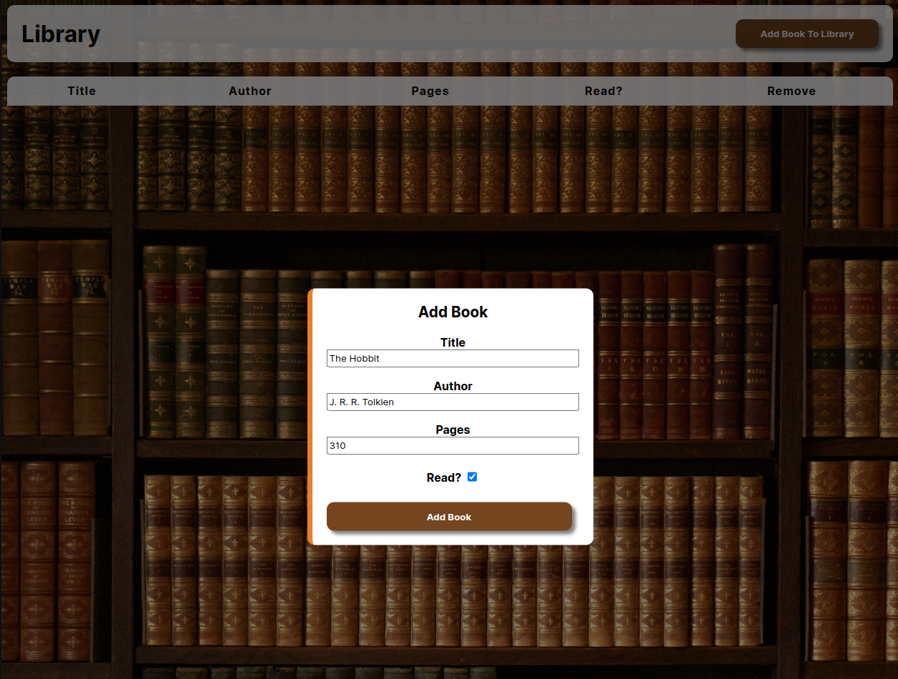
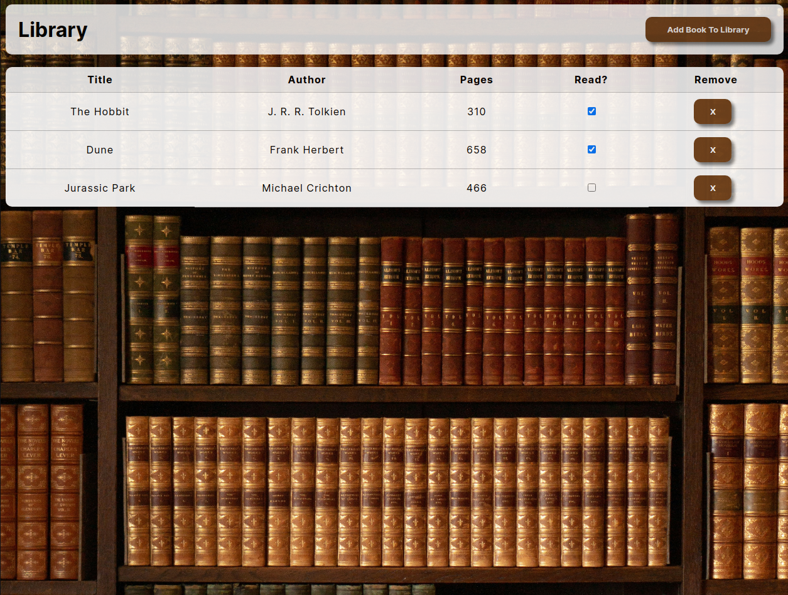
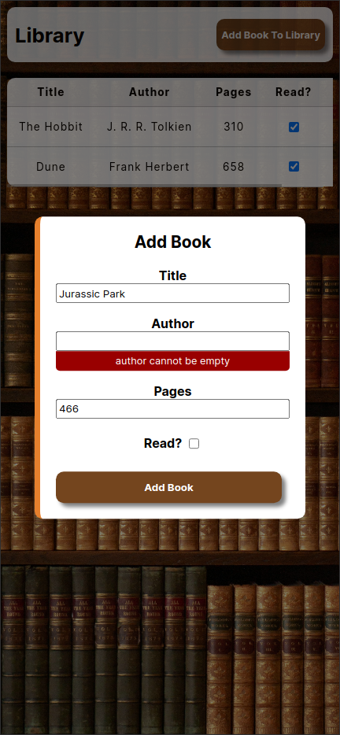

# Odin Project #8: Library

The goal of this Odin Project assignment was to create a library app that allows the user to add books to the table.

I started and finished this project in August 2022.

## Assignment

[The Odin Project - JavaScript - #8 Library](https://www.theodinproject.com/lessons/node-path-javascript-library)

## Technology

- HTML
- CSS
- Vanilla JavaScript

## Key Concepts

- Objects and object constructors
- Classes
- Array of objects
- Tables
- Custom form validation messages

## Features

- Popup window form for filling out book information
- Clicking outside of the popup window closes it
- Scrollable table for mobile view
- Can mark books as read or remove them

## Links

[Live Demo](https://bn7631-odin-library.pages.dev)

## Screenshots

### Desktop





### Mobile



## Sources

- https://unsplash.com/photos/fhOQfT1eVEA by Eilis Garvey
- https://fonts.google.com/specimen/Inter

## Deployment

```bash
  git clone https://github.com/BrightNeon7631/odin-library.git
```
